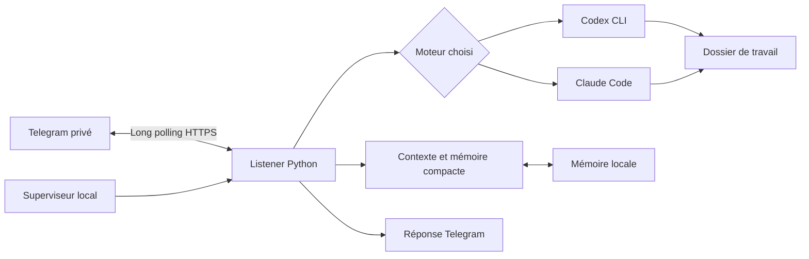

# Architecture de la version initiale

Vibe Claw Light est un programme Python local qui reçoit les messages d'un compte Telegram associé et les confie à Codex CLI ou Claude Code. Il fournit le contexte personnel, garde l'identifiant de conversation du moteur et renvoie la réponse.

## Périmètre

- Un utilisateur, un bot et un dossier de travail par installation.
- Messages texte et documents jusqu'à 20 Mio, conversation persistante et mémoire compacte commune aux moteurs.
- Démarrage détaché et rechargement du listener via `/reload`.
- Python 3.11 ou supérieur ; pas de service web à exposer ni de port entrant à ouvrir pour Telegram.
- Aucune dépendance Python nécessaire au runtime dans la version initiale.

Le long polling initie une connexion sortante vers Telegram. Le PC reste nécessaire pendant toute l'exécution. Cette version ne se substitue pas à un service hébergé et ne s'installe pas automatiquement au démarrage du système.

## Les deux moteurs

Le choix est stocké dans `config.env`. L'installation ne prépare que le moteur choisi. Chaque adaptateur transforme la demande en invocation non interactive du CLI et récupère sa réponse ainsi que son identifiant de session. Les sessions de Codex et de Claude restent propres à leur moteur ; la mémoire durable est partagée.

Codex utilise un sandbox `workspace-write` avec refus des demandes d'autorisation supplémentaires en mode non interactif. Claude limite initialement les outils disponibles à `Read`, `Write`, `Edit`, `Glob` et `Grep`. Les commandes système sont un choix explicite via `ALLOW_SHELL`. Claude natif sur Windows ne fournit pas de sandbox OS : cette différence doit rester visible à l'installation.

Les CLI sont de vrais programmes locaux, avec leur authentification et leurs limites d'usage. Le projet ne contient ni clé API ni mécanisme de secours payant. Le diagnostic `--live` vérifie une réponse du moteur réellement configuré.

## Mémoire et rangement

La conversation aide à suivre la tâche en cours. La mémoire retient ce qui doit rester utile dans une prochaine conversation : quelques faits de profil, préférences de travail et projets avec leurs points d'entrée.

Une entrée projet sert de carte : nom usuel, chemin, rôle des principaux sous-dossiers, fichier à lire en premier. Elle ne recopie pas le contenu de tous les documents. Quand le projet revient dans la conversation, l'agent retrouve ce repère et vérifie les fichiers actuels avant de travailler.

Les règles de travail demandent de respecter la structure existante, conserver les sources, ranger les livrables près du projet et nettoyer les fichiers temporaires sans valeur durable. Une correction explicite remplace une ancienne préférence. `/memory` et `/forget` donnent accès à cette mémoire. L'oubli invalide les références aux sessions des deux moteurs ; les historiques Telegram et fournisseur restent indépendants. Les limites et le format exact sont documentés dans [MEMOIRE.md](MEMOIRE.md).

## État local

| Emplacement | Rôle |
| --- | --- |
| `run.py` et `src/vibe_claw_light/` | Programme partageable |
| `config.env.example` | Configuration vide partageable |
| `config.env` | Moteur, token, compte associé, dossier et options privés |
| `data/` | État et données de fonctionnement privés |
| `memory/` | Souvenirs structurés et index lisible privés |
| `identity/` | Personnalité locale de l'assistant |
| `workspace/` par défaut | Documents sur lesquels travaille l'agent |
| `.venv/` | Python et environnement locaux, recréables |

Les emplacements privés sont exclus de Git. L'installation est indépendante du projet Vibe Claw d'origine et de ses données. Une variable `VIBE_CLAW_ROOT` héritée est préservée, sans servir à sélectionner la racine de cette installation ; l'option propre `--root PATH` permet de préciser une autre racine de données pour ce programme.

## Cycle de vie

`start` lance un superviseur en arrière-plan. Le listener traite les messages autorisés et délègue chaque demande au moteur. `/stop` interrompt la tâche courante et met la file en pause ; `/continue` ou un nouveau message reprend les demandes en attente. `/clear` repart avec une nouvelle conversation en conservant les souvenirs. `/reload` fait reprendre le listener avec le code local courant. `stop` depuis le PC arrête le service entier.

Un changement de code sur disque reste possible pendant l'exécution ; il prend effet après un rechargement. La version initiale ne fournit pas de mise à jour distante automatique ni de rollback automatique d'une modification incorrecte.

## Validation et limites

Les tests automatisés doivent porter sur l'autorisation Telegram, les chemins avec espaces, les deux adaptateurs, la mémoire, l'arrêt et le redémarrage. Des tests avec des processus simulés ne prouvent ni l'accès au compte du participant ni le comportement réel du sandbox Windows.

La préparation de cette release a vérifié le script sous PowerShell 5.1, les chemins contenant des espaces et accents, le rejet des shims npm et la propagation des erreurs. Une exécution native Windows de l'installateur avec `-SkipSetup`, `uv` et un binaire Codex déjà disponibles a créé l'environnement Python 3.11. Des tests du runtime ont aussi été exécutés nativement. Cela ne valide pas encore le parcours complet d'un compte neuf et d'un bot réel.

Avant une diffusion en atelier, vérifier sur un Windows 11 propre : extraction sans Git, installation sans Python/Node, connexion au moteur, association Telegram, création de fichier, `/clear`, `/stop`, `/reload`, arrêt et nouveau démarrage. Répéter le parcours pour chaque moteur annoncé. Les preuves de validation doivent indiquer les systèmes et les versions testés.

Le projet prépare le parcours Windows natif ; la release initiale ne garantit pas son fonctionnement sur toute configuration d'entreprise, tout antivirus ou toute version du CLI. Un échec de permission doit être expliqué et traité dans la configuration locale autorisée.
