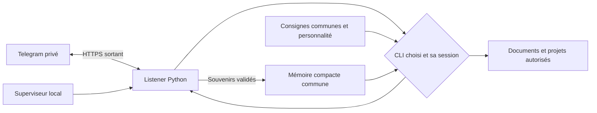

# Architecture de Vibe Claw Light v0.2

Le programme Python reçoit les messages d'un compte Telegram associé, appelle Codex CLI ou Claude Code et renvoie la réponse. La couche Telegram, le superviseur et le setup sont propres à ce starter. Les CLI conservent la conversation et gèrent leur contexte.

## Périmètre

- Un utilisateur et un bot par installation.
- Texte et documents jusqu'à 20 Mio ; pas de vocal ni de modèle local.
- Python 3.11+ et bibliothèque standard pour le runtime.
- Windows natif, macOS et Linux ; le PC doit rester allumé et connecté.
- Long polling Telegram : aucun serveur à exposer sur Internet.
- Démarrage en arrière-plan à la demande, sans lancement automatique au démarrage du PC.

## Conversation, consignes et mémoire

Le listener conserve un identifiant de session par moteur. Il utilise `codex exec resume` ou `claude --resume` pour poursuivre la discussion. Il ne résume pas les étapes d'une tâche pour reconstruire cette discussion. Un changement de moteur retrouve la session de ce moteur, si elle existe, et la mémoire commune ; il ne transfère pas l'historique complet de l'autre CLI.

`context.py` sépare les consignes stables des données qui évoluent :

- Le socle commun contient `instructions.txt`, les règles du protocole `MEMORY_INSTRUCTIONS` et la consigne de retrouver le contexte courant après une compaction. Codex le reçoit à la création de la session via `developer_instructions`. Claude le lit via `--append-system-prompt-file`, avec `--system-prompt-snapshot off`.
- Un snapshot privé dans `data/context/current.md` contient l'identité, les dossiers autorisés, le `SOUL.md` facultatif limité à 2 000 caractères et la mémoire limitée à 8 000 caractères. Une empreinte identifie sa version.

Le snapshot complet accompagne le premier message d'une session et les messages pour lesquels son empreinte a changé. Le runtime suit cette empreinte séparément pour chaque moteur et chaque session. Les autres messages contiennent seulement la demande, la date et une référence courte avec l'empreinte et le chemin du snapshot. Les données de mémoire ne sont pas utilisées comme des règles natives.

Après une compaction du CLI, les consignes persistantes demandent au modèle de relire le snapshot courant s'il n'est plus présent dans son contexte. Cette relecture passe par son outil de fichier. Elle ne reconstruit pas l'historique de la conversation.

Le socle et les snapshots restent des tokens dans le contexte du moteur : ce changement évite des copies à chaque tour, sans rendre leur coût nul. Les détails des projets restent dans leurs documents, que le modèle lit au moment du travail demandé.

La mémoire automatique propre à Claude et à Codex est désactivée par les options de ces appels uniquement. La configuration globale des CLI n'est pas modifiée. `AGENTS.md` et `CLAUDE.md` servent de repères pour travailler sur le dépôt ; les règles runtime ne sont pas dupliquées dans ces fichiers. Les autres instructions natives du CLI peuvent continuer à s'appliquer.

Le profil utilisateur et les préférences sont dans la mémoire commune, sans `USER.md` supplémentaire. La mémoire, ses preuves et ses limites sont décrites dans [MEMOIRE.md](MEMOIRE.md).

## Accès aux fichiers et outils

`WORKSPACE` indique où ranger les nouveaux travaux. Il est distinct de la liste des dossiers dans lesquels l'assistant peut intervenir.

| Réglage | `personal`, nouvelles installations | `workspace`, mode limité |
| --- | --- | --- |
| Dossiers | Dossier utilisateur, installation, rangement et `EXTRA_DIRS` | Installation, rangement et `EXTRA_DIRS` |
| Codex | `workspace-write`, commandes et réseau actifs | `workspace-write`, réseau désactivé |
| Claude | Outils de fichiers, commandes et outils web | Outils de fichiers ; commandes si `ALLOW_SHELL=1` |

Les actions gardent les droits du compte utilisateur. Codex refuse les élévations interactives pendant les appels du bot. Les outils autorisés de Claude ne constituent pas une sandbox du système d'exploitation sur Windows. Le mode limité n'est donc pas une garantie identique d'isolation pour les deux moteurs.

Les chemins des fichiers envoyés dans Telegram sont résolus et vérifiés contre les dossiers autorisés. L'envoi de configurations et d'emplacements d'authentification connus, ainsi que de la mémoire, de l'identité et de l'état interne du starter, est bloqué. Ces contrôles de chemins ne détectent pas tous les secrets possibles dans un document ordinaire.

## Installation et connexion

Le setup ouvre une page locale sur `127.0.0.1`, avec une adresse de session privée. Elle reçoit le nom, le dossier de rangement, les options d'accès et le token Telegram. Le lien `/start` temporaire associe ensuite le propriétaire.

Si le CLI n'est pas connecté, le setup lance `codex login` ou `claude auth login` dans un terminal interactif. Il utilise celui de l'installation si possible, sinon ouvre une fenêtre locale. Le navigateur du fournisseur et le terminal traitent la connexion, y compris un éventuel code à recopier. Notre page ne reçoit aucun mot de passe ni code OAuth. Si aucune fenêtre ne peut être ouverte, elle affiche la commande à lancer manuellement, puis permet de revérifier la connexion.

Le diagnostic `doctor --live` demande une petite réponse au moteur réellement connecté. L'installateur le lance avant le démarrage du service. Les parcours testés et leurs limites figurent dans [VALIDATION.md](VALIDATION.md) ; un test simulé ne valide pas une connexion neuve sur Windows.

## État local

| Emplacement | Rôle |
| --- | --- |
| `run.py`, `src/vibe_claw_light/` | Programme partageable |
| `config.env.example` | Exemple de configuration sans secret |
| `config.env` | Paramètres privés du bot, du moteur et des accès |
| `data/` | État, pièces jointes et contexte généré privés |
| `memory/memory.json` | Source de vérité des souvenirs |
| `memory/INDEX.md` | Vue lisible générée |
| `identity/SOUL.md` | Personnalité facultative |
| `~/Documents/MonAssistant` par défaut | Rangement des nouveaux travaux |
| `.venv/` | Environnement Python local, recréable |

Les données internes privées sont exclues de Git. Les documents rangés hors du dépôt restent sous la responsabilité de leur propre dossier. Une variable `VIBE_CLAW_ROOT` héritée est conservée, sans sélectionner la racine de ce starter. L'option `--root PATH` choisit sa propre racine de données.

## Cycle de vie et mise à jour

`start` lance le superviseur. `/stop` interrompt la tâche et met la file en pause ; `/continue` ou un nouveau message reprend la file. `/clear` oublie les identifiants de conversation et conserve les souvenirs. `/reload` recharge le code en conservant sessions et mémoire. La commande locale `stop` arrête le service entier.

Un oubli de mémoire invalide aussi les références aux deux sessions pour ne pas repartir avec leur ancien contexte. Cela n'efface ni Telegram ni les historiques des fournisseurs. Un changement des dossiers autorisés, du mode d'accès ou du socle de règles natives repart également avec de nouvelles sessions. Une empreinte des règles permet de détecter cette dernière situation au redémarrage. Les changements du profil, de SOUL.md et des souvenirs sont transmis par le snapshot, sans réinitialiser la conversation.

Le runtime garde aussi l'empreinte du socle natif. Si `instructions.txt` ou le protocole de mémoire change, le prochain rechargement ouvre de nouvelles sessions pour que les deux moteurs prennent les nouvelles règles en compte. Une modification du nom, de `SOUL.md` ou des souvenirs actualise seulement le snapshot, sans perdre la session en cours.

Les configurations v0.1 sans `ACCESS_MODE` restent en mode `workspace`, avec leur dossier et leur choix de commandes Claude. Mettre à jour le code n'élargit pas leurs accès. Le programme n'installe pas de mise à jour distante automatique ni de retour automatique à une ancienne version du code.
